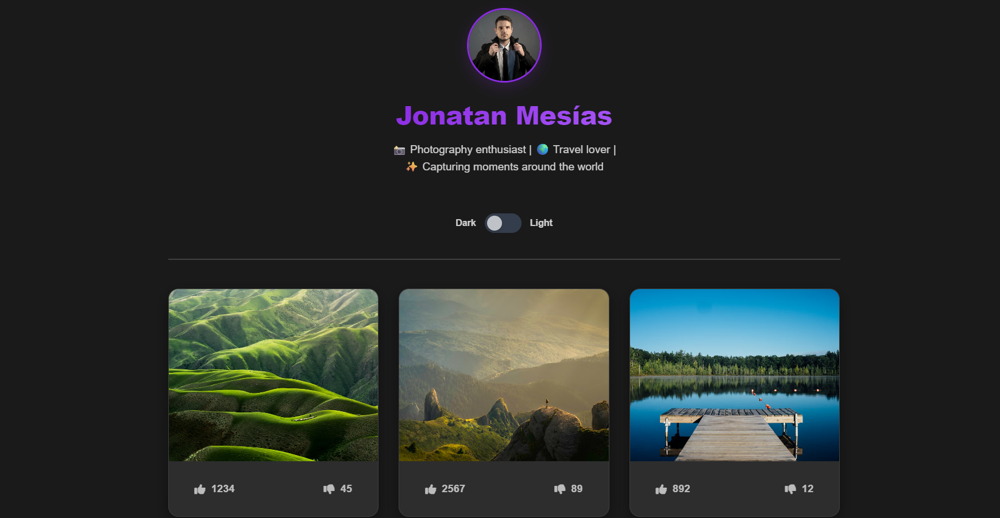
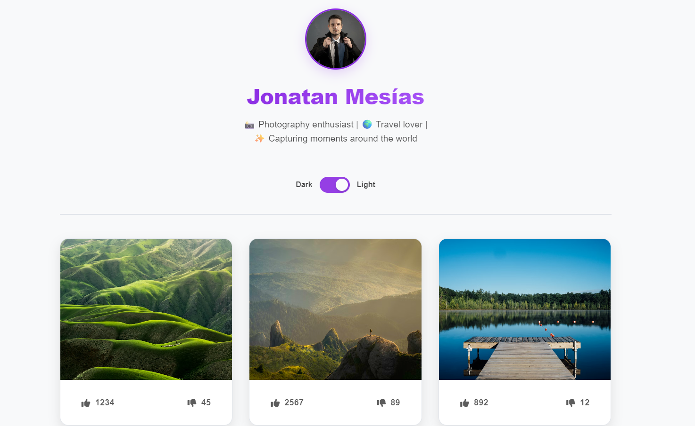

# 📸 Instagram Gallery Clone

Galería interactiva inspirada en Instagram desarrollada con **HTML, CSS y JavaScript vanilla**.
El proyecto simula un perfil fotográfico con interacción realista, lightbox, navegación, likes y modo oscuro/claro.

Diseñado como proyecto de **portfolio frontend**, enfocado en experiencia de usuario, diseño moderno y código limpio sin frameworks.

---

## ✨ Demo
👉 Live demo: [(https://johnnmtdev.github.io/ig_porfolio_js_vanilla/)]
---

## 🖼️ Preview

---

## 🧩 Características principales

- 🖼️ Galería de imágenes tipo Instagram
- 🔍 Vista ampliada (modal / lightbox)
- ⬅️➡️ Navegación entre imágenes (clic y teclado)
- 🌗 Modo oscuro y modo claro (dark por defecto)
- ❤️ Sistema de likes y dislikes interactivo
- 📱 Diseño totalmente responsive
- ⚡ JavaScript ES6 sin dependencias externas
- 🧠 Estado de aplicación manejado en memoria
- 🎨 Sistema de diseño basado en variables CSS

---

## 🛠️ Tecnologías utilizadas

- **HTML5 semántico**
- **CSS3 avanzado**
  - Variables CSS
  - Grid & Flexbox
  - Animaciones y transiciones
- **JavaScript ES6+**
  - Manipulación del DOM
  - Gestión de estado
  - Eventos y accesibilidad por teclado

---

## 🎯 Objetivo del proyecto

- Simular una experiencia real de red social
- Practicar JavaScript sin frameworks
- Demostrar habilidades de UI/UX frontend
- Crear un proyecto sólido para portfolio profesional

---

## 🚀 Cómo ejecutarlo

1. Clona el repositorio
2. Abre `index.html` en tu navegador
3. Disfruta de la galería interactiva

No requiere instalación ni dependencias.

---

## 🔮 Mejoras futuras

- Persistencia de likes y tema con `localStorage`
- Lazy loading de imágenes
- Animaciones avanzadas
- Versión React del proyecto

---

## 👨‍💻 Autor

**Jonatan Mesías**  
Frontend Developer  
📧 email  
💼 LinkedIn  
🐙 GitHub

